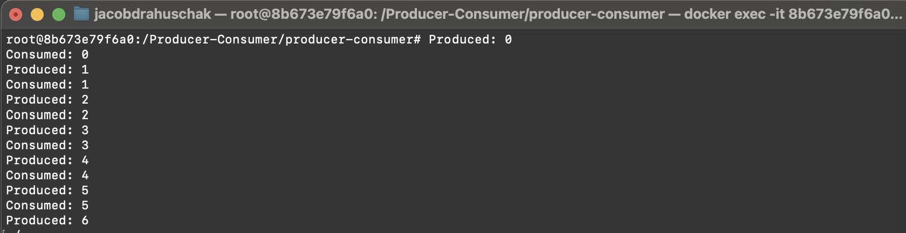
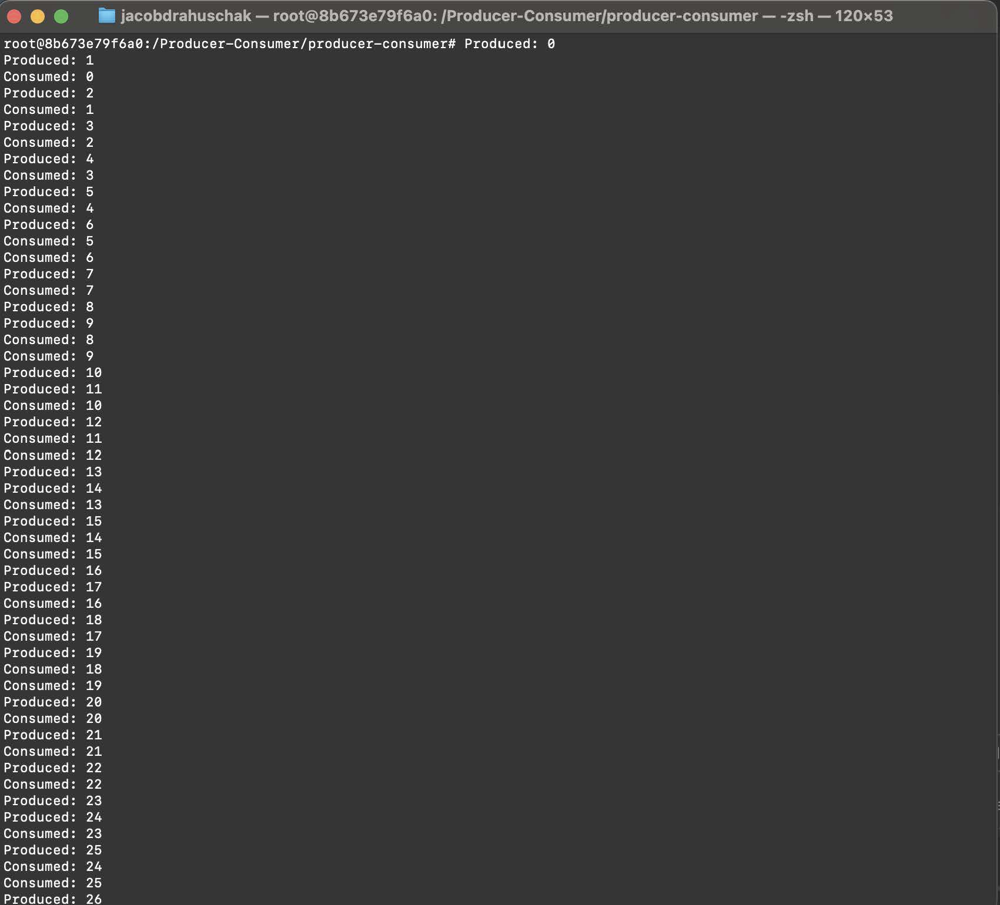

# Producer-Consumer (POSIX Shared Memory & Semaphores)

This project demonstrates a Producer-Consumer problem implemented in C++ using POSIX shared memory and semaphores for inter-process synchronization.

The programs are designed to run inside an Ubuntu Docker container.

## Overview

- Producer (`producer.cpp`) generates a sequence of integers and writes them to a shared memory buffer.
- Consumer (`consumer.cpp`) reads the integers from shared memory and prints them.
- Synchronization is handled using named semaphores to prevent race conditions.

## Requirements

- Docker (latest version)
- GCC and POSIX libraries inside the Docker container (`build-essential`)

# Build and run the Docker container
From your host system:

Copy files from Host to Docker Container:
docker cp FOLDER_NAME CONTAINER_NAME:/Producer-Consumer

From inside that container we need to install g++ which is a compiler for c++ files:

apt update
apt install -y build-essential

--
Now compile the Code with:

g++ producer.cpp -pthread -lrt -o producer
g++ consumer.cpp -pthread -lrt -o consumer

--
Execute in the same Docker Container:

./producer & ./consumer &

Output:

Produced: 0
Produced: 1
Consumed: 0
Consumed: 1

--

You can then stop the process in a seperate terminal by entering:

docker stop <container_id>

EXAMPLE:

-

